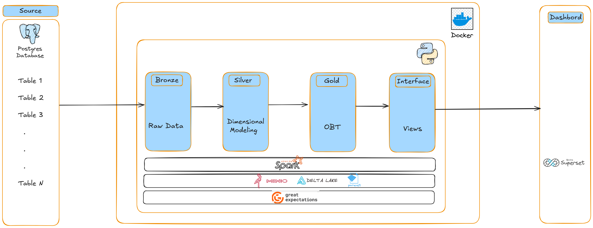

# 🚀 TPC-H Analytics Pipeline

## 📌 Introduction

Ce projet vise à construire un **pipeline analytique complet**, basé sur les **données TPC-H** stockées dans une base **PostgreSQL**.  
L'objectif est de **traiter, transformer et structurer** ces données afin d'extraire des **KPIs métier** exploitables dans un **dashboard** ou une solution de reporting (*Power BI, Tableau, etc.*).

J'ai adopté une approche **modulaire et scalable** avec une architecture multi-couches **Bronze → Silver → Gold**, et j'ai mis en place un ensemble de **règles de Data Quality** afin de garantir la fiabilité des résultats.

---

## 🏗️ Architecture du Pipeline

### 🔹 **1. Ingestion (Bronze Layer)**
- Extraction complète des données depuis **PostgreSQL** à chaque exécution (**Full Load**).
- Stockage brut des données dans **Minio**.
- Format de stockage : **Parquet / Delta Lake** .

### 🔸 **2. Transformation & Modélisation (Silver Layer)**
- Structuration en tables de **Faits** et **Dimensions** .
- Nettoyage des données : typage, gestion des valeurs nulles, uniformisation des formats.
- Application des premières règles de **Data Quality**.

### 🏅 **3. Calcul des KPIs & Agrégations (Gold Layer)**
- Construction des tables **prêtes pour l’analyse** (One Big Table ou tables KPI spécifiques).
- Calcul des **métriques clés** :
  - **Chiffre d’affaires quotidien**
  - **Nombre de commandes par jour et par segment client**
  - **Délai moyen de livraison**
  - **Top fournisseurs et produits les plus vendus**
- Création de vues SQL / modèles pour le **dashboard**.

### 🎯 **4. Exposition des Données (Interface Layer)**
- Mise à disposition via :
  - Vues BI prêtes à être consommées par **Power BI / Tableau**

---

## 📊 **Données Source (TPC-H - PostgreSQL)**

Les tables utilisées dans ce projet proviennent du dataset **TPC-H**, qui simule un environnement de **gestion de commandes et de ventes**.

### **Tables Clés**
| Table       | Description |
|-------------|------------|
| `customer`  | Liste des clients |
| `orders`    | Commandes passées par les clients |
| `lineitem`  | Détails des articles commandés |
| `supplier`  | Informations sur les fournisseurs |
| `part`      | Catalogue des produits |
| `nation`    | Référentiel des pays |
| `region`    | Référentiel des régions |

📌 **Volume estimé** : dépend du *scale factor* utilisé pour générer le dataset TPC-H.

---

## 🛠️ **Technologies & Stack**
| Outil / Techno      | Utilisation |
|---------------------|-------------|
| **PostgreSQL**      | Base de données source |
| **Apache Spark / Pandas** | Traitement des données (ETL) |
| **Parquet / Delta Lake** | Format de stockage optimisé |
| **Sperset** | Visualisation et reporting |
| **Great Expectations** | Vérification de la qualité des données |
| **Docker** | Conteneurisation |
| **Minio**| Stockage data lake |

